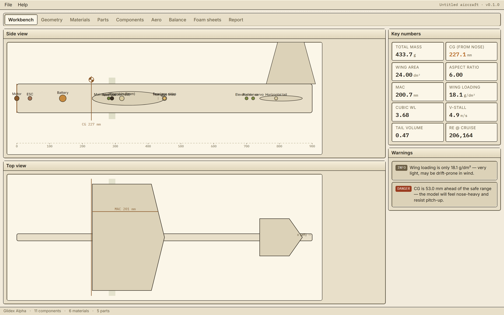
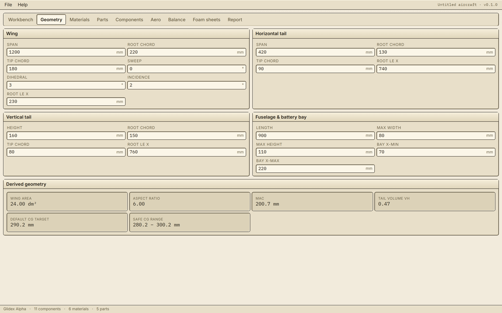
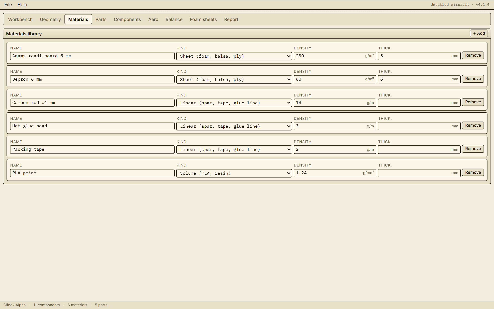
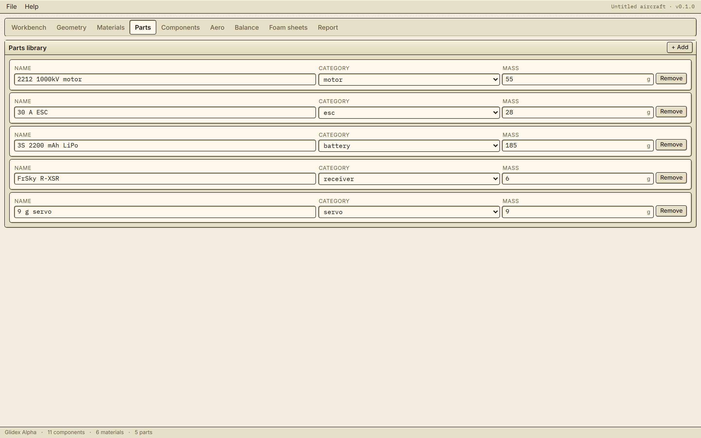
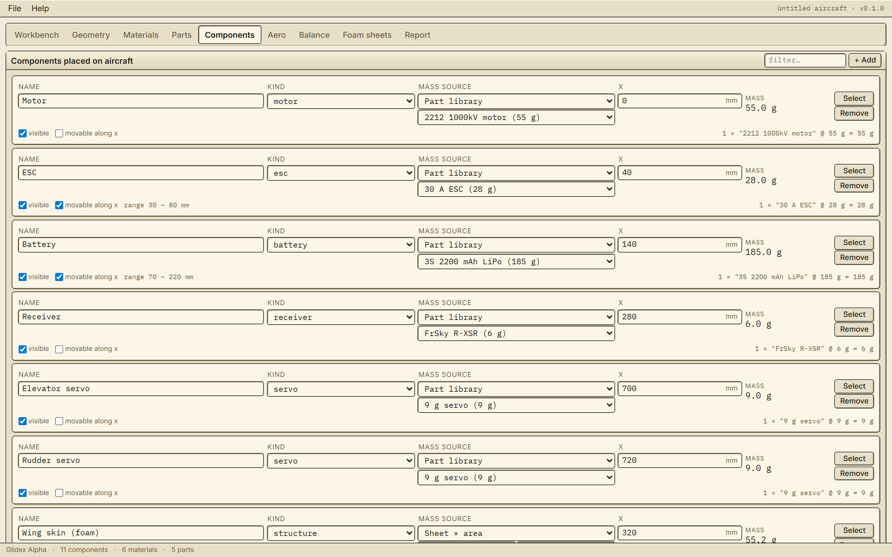
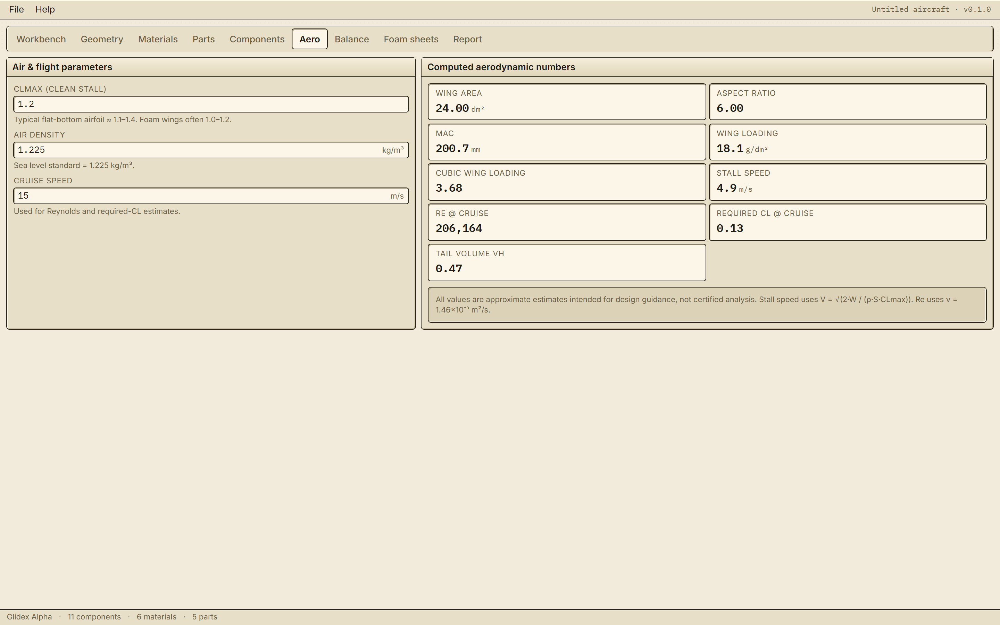
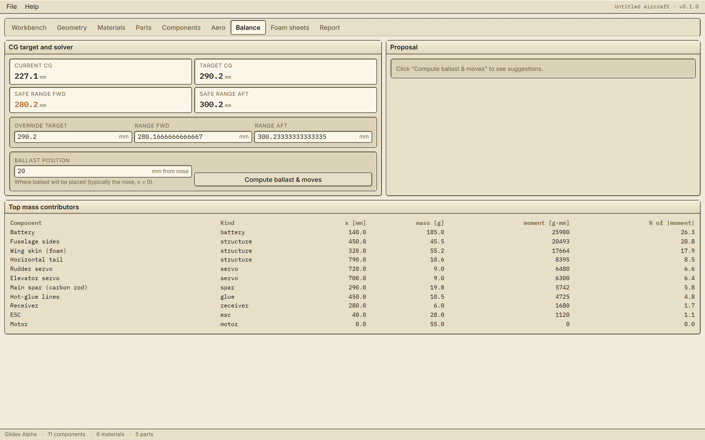
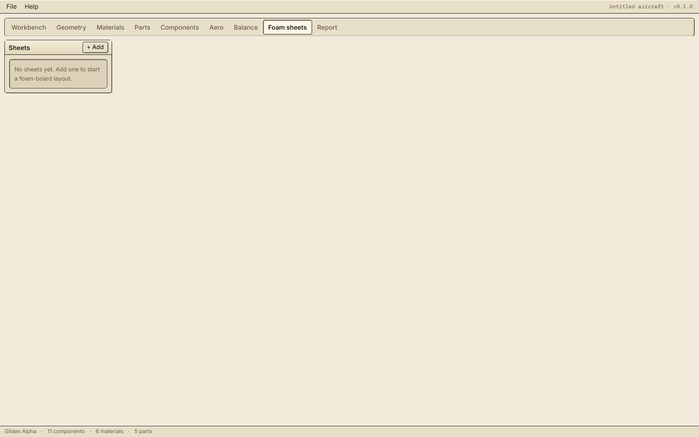
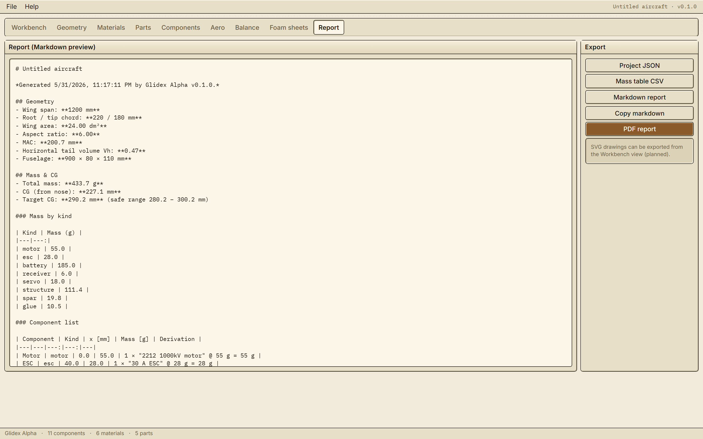

# Glidex Alpha

> A practical RC aircraft design workbench for builders who want to **calculate, balance, document, and refine** their own aircraft designs.

[](https://github.com/giagos/Glidex-Alpha/actions/workflows/pages.yml)
[](https://github.com/giagos/Glidex-Alpha/actions/workflows/release.yml)
[](LICENSE)

Glidex Alpha is the modern rebuild of the original [Glidex](https://github.com/giagos/Glidex)
Lua/LÖVE 1‑D balancer. It keeps the same philosophy — *the user is in charge, nothing
is assumed* — and extends it into a focused desktop + web app for foam‑board, balsa,
and 3D‑printed RC aircraft.

No CFD. No full CAD. No CAM. No autopilot. Just trustworthy geometry, mass, CG,
basic aerodynamics, lightweight drawings, foam‑board sheet planning, and clean reports.

---

## 🚀 Try it now

| | |
| --- | --- |
| 🌐 **Web app (hosted)** | **<https://giagos.github.io/Glidex-Alpha/>** |
| 💾 **Windows installer** | **[Download latest release](https://github.com/giagos/Glidex-Alpha/releases/latest)** |
| 📂 **Source code** | <https://github.com/giagos/Glidex-Alpha> |

The hosted web build and the Windows desktop installer are produced from the same
source. The web build stores projects in IndexedDB and supports drag‑and‑drop
import / download of `.glidex.json` files; the Electron build reads and writes real
files on disk.

---

## 📸 Screenshots

### Workbench — overview, totals, CG, warnings at a glance


### Geometry — wing, tail, fuselage, battery bay


### Materials — user‑defined foam, glue, spars, tape, PLA


### Parts — reusable library of servos, motors, ESCs, batteries


### Components — place every part along the fuselage


### Aero — wing loading, cubic loading, stall, Reynolds, required CL


### Balance — CG, contributions, ballast solver


### Foam sheets — sheet layout for printable construction


### Report — clean printable summary of the whole project


---

## ✨ Features

- **Cream Retro / Neo‑Platinum UI** — warm off‑white panels, hard 1‑px borders,
  tactile bevels. Calm, paper‑like, structured. No glass, no neon.
- **Geometry** — wing area, aspect ratio, taper, MAC, MAC location, tail volume
  (horizontal & vertical), tail lever arm.
- **User‑defined materials** — define foam g/m², glue g/m, spar g/m, PLA g/cm³,
  tape g/m, anything. Nothing is hard‑coded.
- **Parts library** — reusable servos, motors, ESCs, RX, battery presets.
- **Components placement** — drop every meaningful mass onto the aircraft with
  a position along the fuselage.
- **Mass roll‑up & CG** — total mass and 1‑D centre of gravity, with per‑component
  contribution analysis so you can see *which* part is pulling the CG.
- **Aero (approximate)** — wing loading (g/dm² and oz/ft²), cubic wing loading,
  stall speed (CLmax user‑set), Reynolds estimate at chosen speed and MAC,
  required CL at cruise.
- **Ballast solver** — deterministic optimiser. You flag which parts are movable
  (e.g. battery within the bay, ESC ±10 mm, ballast nose‑only) and it computes
  the *minimum ballast* needed to land in your target CG range.
- **Warnings** — high wing loading, tiny tail volume, CG out of range, suspicious
  values. Every warning is explainable.
- **Drawings** — SVG side view and top view with fuselage, wing & tail outlines,
  component dots, CG marker, safe CG band, battery bay shading.
- **Foam‑board sheet layout** — define your sheet size, place flat parts on it,
  export the layout for printing or as a build reference.
- **Exports** — Project JSON (round‑trip, Zod‑validated), CSV mass table,
  Markdown report, PDF report (pdf‑lib), SVG and PNG drawings.
- **Dual target** — runs identically as a Windows desktop app (Electron) and
  as a static web app (GitHub Pages).

---

## 🧰 Tech stack

Electron 33 · React 18 · TypeScript 5 · Vite 6 · Tailwind CSS 3 · Zustand · Zod
· pdf‑lib · Vitest · electron‑builder (NSIS).

---

## 🏗️ Run from source

```powershell
git clone https://github.com/giagos/Glidex-Alpha.git
cd "Glidex-Alpha"
npm install

# Web (browser) dev server
npm run dev:web        # http://localhost:5173

# Electron desktop dev (Windows / macOS / Linux)
npm run dev:electron

# Run tests + typecheck
npm test
npm run typecheck
```

## 📦 Build

```powershell
# Static web bundle (deployable to any static host)
npm run build:web

# Web bundle for GitHub Pages (base = /Glidex-Alpha/)
npm run build:pages

# Windows installer (.exe via NSIS, output to release/)
npm run build:electron
```

The Windows installer is produced by `electron-builder` and lands in `release/`
as `Glidex-Alpha-Setup-<version>.exe`. It is also built and attached to a GitHub
Release automatically whenever you push a tag starting with `v` (see
`.github/workflows/release.yml`).

---

## ☁️ Continuous deployment

- **GitHub Pages** — `.github/workflows/pages.yml` rebuilds and publishes the
  web app on every push to `main`. Enable it once in
  *Settings → Pages → Build and deployment → Source: GitHub Actions*.
- **Windows installer release** — `.github/workflows/release.yml` runs on
  `windows-latest`, builds the NSIS installer, and attaches it to a GitHub
  Release. Trigger it with:

  ```powershell
  git tag v0.1.0
  git push --tags
  ```

  Or run it manually from the *Actions* tab.

---

## 🗺️ Workflow

1. Create a project (or open an existing `.glidex.json`).
2. Enter wing, tail, fuselage dimensions and the battery bay range.
3. Define your materials (foam thickness + g/m², glue g/m, spars g/m, etc.).
4. Build a parts library (motors, ESCs, servos, RX, battery presets).
5. Place components along the fuselage. Mass is derived from material × geometry
   unless you override it with a measured value.
6. Read the workbench: total mass, CG, wing loading, stall speed, warnings.
7. Open the Balance tab and let the ballast solver find the lightest layout
   that keeps the CG inside your target range — using only the movements you
   allowed.
8. Lay out the foam‑board sheets.
9. Export a JSON project, a CSV mass table, a Markdown or PDF report, and
   SVG / PNG drawings.

---

## ❌ Out of scope (on purpose)

- CFD, panel methods, vortex lattice
- Full 3D CAD, lofting, surface modelling
- CAM / CNC toolpaths
- Autopilot or flight planning
- Cloud sync, accounts, multi‑user
- DXF export (planned for v2)

---

## 📁 Project layout

```
electron/           Electron main + preload (IPC for file I/O)
src/
  app/              App shell + per‑tab views
  components/       Cream retro UI primitives (Window, Panel, Button, Field, Menu, Tabs)
  domain/           Pure TS: geometry, mass, aero, ballast solver, sheets, validation
  drawing/          SVG views (side, top, sheet layout, CG marker)
  state/            Zustand store
  persistence/      Filesystem adapter (Electron) + IndexedDB adapter (web)
  export/           JSON, CSV, Markdown, PDF, SVG, PNG exporters
  styles/           Design tokens + retro CSS
scripts/            Tooling (screenshot capture)
docs/screenshots/   README screenshots
.github/workflows/  Pages deployment + Windows installer release
```

See [`REPLICATION_GUIDE.md`](REPLICATION_GUIDE.md) for the full architectural
walk‑through.

---

## 📜 License

MIT — see [LICENSE](LICENSE).
